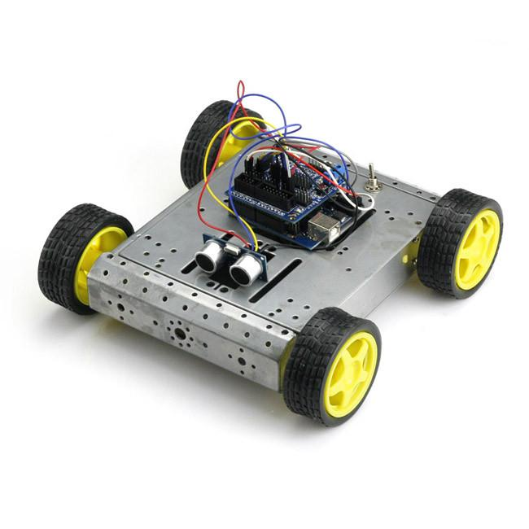

# sainsmartremotecontrol

This is firmware used in the robot so called "Hercules" in order to allow remote controlling available at: [seeed studio](https://www.seeedstudio.com/Skeleton-Bot-4WD-Hercules-Mobile-Robotic-Platform-p-1504.html)
Used along with [remote_lvc](https://github.com/aleaugustoplus/remote_lvc) sofware that is used in the remote controlling interface

## Getting Started

Download the firmware in the robot using arduino software platform

## Robot Image

## Running the tests

Automated tests have not been used 

## Built With

* [Arduino](https://www.arduino.cc/)

## Contributing

Please stay free to submit pull requests at any time

## Authors

* **Alexandre Lopes** - *Initial work* - [Alexandre Lopes](http://alexandre-lopes.com)

## License

This project is licensed under the MIT License - see the [LICENSE](https://en.wikipedia.org/wiki/MIT_License) page for details

## Acknowledgments

* Some third party open source libraries have been used thank you for that thanks seeedstudio.com

https://aprendizadodemaquina.com
